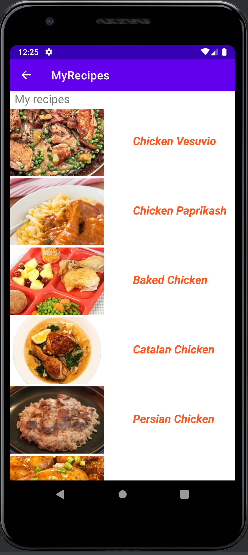
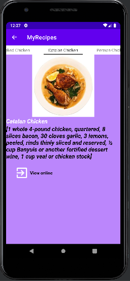

# My Recipes
This project was generated with Android Studio
#### By ISSA SAITEMU
#### SCREEN SHORTS

## Description
An Android application that allows users to find new recipes and save them.
## Setup/Installation Requirements
* create an empty git repository
* git init
* git clone https://github.com/lelemoyog/core-android-ip.git
* and start using code

## Technologies Used
* gradle
* java/android
## Support and contact details
For any support contact me via email issasaitemu@gmail.com
### License
[MIT License](License).
Copyright (c) {2021}  Saitemu Issa.